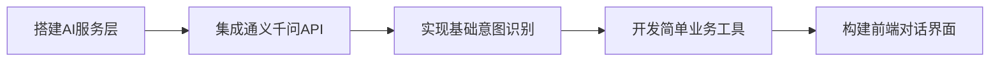
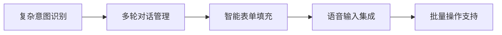
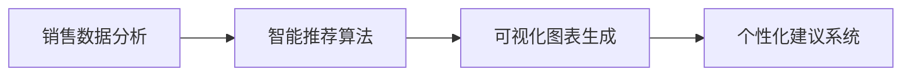
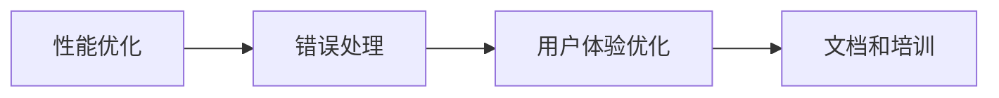

# 个体超市管理系统 AI架构设计与应用场景分析

## 📋 目录
- [AI应用场景分析](#ai应用场景分析)
- [AI架构设计](#ai架构设计)
- [技术选型](#技术选型)
- [实施优先级](#实施优先级)
- [开发计划](#开发计划)

---

## 🎯 AI应用场景分析

### 1. 智能语音助手 - 核心功能
> **目标**: 通过自然语言简化复杂操作，提升工作效率

#### 1.1 商品管理简化
**传统操作痛点**:
- 添加商品需要填写多个表单字段
- 批量操作需要逐个选择
- 查找商品需要记住准确名称

**AI简化方案**:
```
用户: "添加一箱可口可乐，进价3元，售价5元，库存50瓶"
AI: 自动解析并填充商品信息，确认后直接添加

用户: "把所有过期的面包下架"
AI: 自动查询过期面包，批量执行下架操作

用户: "查看苹果的销售情况"
AI: 智能搜索相关商品，展示销售数据和趋势
```

#### 1.2 库存管理智能化
**传统操作痛点**:
- 手动盘点耗时费力
- 补货决策依赖经验
- 库存预警设置复杂

**AI简化方案**:
```
用户: "今天需要补货什么？"
AI: 分析销售趋势和库存水平，推荐补货清单

用户: "帮我设置牛奶的库存预警"
AI: 基于历史销售数据，智能设置合理的预警阈值

用户: "盘点饮料区"
AI: 引导用户进行智能盘点，自动记录差异
```

#### 1.3 收银操作优化
**传统操作痛点**:
- 商品条码损坏时查找困难
- 促销活动设置复杂
- 退换货流程繁琐

**AI简化方案**:
```
用户: "这个苹果的条码坏了"
AI: 通过商品描述快速匹配，直接添加到购物车

用户: "给这个客户打8折"
AI: 智能应用折扣，自动计算优惠金额

用户: "客户要退这瓶牛奶"
AI: 快速处理退货流程，自动更新库存和财务记录
```

### 2. 智能数据分析 - 决策支持
> **目标**: 将复杂数据转化为易懂的商业洞察

#### 2.1 销售分析智能化
**传统操作痛点**:
- 报表数据复杂难懂
- 趋势分析需要专业知识
- 异常数据难以发现

**AI简化方案**:
```
用户: "这个月生意怎么样？"
AI: 自动分析销售数据，用通俗语言解释趋势和问题

用户: "哪些商品卖得不好？"
AI: 智能识别滞销商品，提供处理建议

用户: "什么时候客流量最大？"
AI: 分析客流规律，推荐最佳营业策略
```

#### 2.2 财务管理简化
**传统操作痛点**:
- 成本核算复杂
- 利润分析困难
- 财务报表难以理解

**AI简化方案**:
```
用户: "这个月赚了多少钱？"
AI: 自动计算净利润，分析盈利结构

用户: "哪个供应商最划算？"
AI: 综合分析供应商成本、质量、服务，给出建议

用户: "帮我做个月度财务总结"
AI: 自动生成财务报告，突出关键指标和建议
```

### 3. 智能推荐系统 - 业务优化
> **目标**: 基于数据分析提供个性化建议

#### 3.1 商品推荐
```
场景1: 进货建议
用户: "明天进什么货？"
AI: 基于天气、节假日、历史销售分析，推荐进货清单

场景2: 促销建议
用户: "怎么处理这些积压商品？"
AI: 分析商品特性和市场情况，制定促销策略

场景3: 陈列优化
用户: "怎么摆放商品能卖得更好？"
AI: 基于商品关联分析，推荐最佳陈列方案
```

#### 3.2 客户服务优化
```
场景1: 客户咨询
客户: "有什么好的洗发水推荐？"
AI: 基于库存和销售数据，推荐性价比高的商品

场景2: 会员服务
用户: "这个客户经常买什么？"
AI: 分析客户购买历史，提供个性化服务建议
```

---

## 🏗️ AI架构设计

### 整体架构图
```
┌─────────────────────────────────────────────────────────────┐
│                    前端交互层                                │
├─────────────────────────────────────────────────────────────┤
│  语音输入  │  文本对话  │  智能表单  │  可视化图表  │  推荐面板  │
└─────────────────────────────────────────────────────────────┘
                                │
┌─────────────────────────────────────────────────────────────┐
│                    AI服务层                                 │
├─────────────────────────────────────────────────────────────┤
│  意图识别  │  实体提取  │  对话管理  │  任务执行  │  结果生成   │
└─────────────────────────────────────────────────────────────┘
                                │
┌─────────────────────────────────────────────────────────────┐
│                   业务适配层                                │
├─────────────────────────────────────────────────────────────┤
│  商品管理  │  库存管理  │  销售分析  │  财务管理  │  系统配置   │
└─────────────────────────────────────────────────────────────┘
                                │
┌─────────────────────────────────────────────────────────────┐
│                   数据访问层                                │
├─────────────────────────────────────────────────────────────┤
│  业务数据  │  AI对话历史  │  用户偏好  │  分析结果  │  系统日志  │
└─────────────────────────────────────────────────────────────┘
```

### 核心组件设计

#### 1. AI对话引擎
```java
@Component
public class AiChatEngine {
    // 意图识别
    public Intent parseIntent(String userInput);
    
    // 实体提取
    public Map<String, Object> extractEntities(String userInput, Intent intent);
    
    // 任务执行
    public TaskResult executeTask(Intent intent, Map<String, Object> entities);
    
    // 响应生成
    public String generateResponse(TaskResult result);
}
```

#### 2. 业务工具集
```java
@Component
public class BusinessTools {
    // 商品管理工具
    public String searchProducts(String keyword);
    public String addProduct(ProductInfo info);
    public String updateInventory(String productName, int quantity);
    
    // 销售分析工具
    public String analyzeSales(String timeRange);
    public String getTopProducts(int limit);
    public String checkProfitability();
    
    // 智能推荐工具
    public String recommendRestocking();
    public String suggestPromotion(String productCategory);
}
```

#### 3. 上下文管理
```java
@Component
public class ConversationContext {
    // 会话状态管理
    public void saveContext(String sessionId, ContextData data);
    public ContextData getContext(String sessionId);
    
    // 多轮对话支持
    public boolean needsMoreInfo(Intent intent);
    public String askForMissingInfo(Intent intent, Map<String, Object> entities);
}
```

---

## 🛠️ 技术选型

### AI服务选择
1. **阿里云通义千问 (主要)**
   - 中文理解能力强
   - 成本相对较低
   - 集成简单

2. **本地意图识别 (辅助)**
   - 响应速度快
   - 离线可用
   - 隐私保护

### 开发框架
1. **后端**: Spring Boot + Spring AI
2. **前端**: Vue 3 + Element Plus
3. **数据库**: MySQL + Redis (缓存)
4. **消息队列**: RabbitMQ (异步处理)

---

## 📊 实施优先级

### 第一阶段 (MVP) - 2周
**核心对话功能**
- [x] 基础对话框架搭建
- [x] 简单意图识别 (商品查询、库存查询)
- [x] 基础业务工具集成
- [x] 前端对话界面

### 第二阶段 (增强) - 3周  
**智能操作简化**
- [ ] 复杂意图识别 (商品添加、批量操作)
- [ ] 多轮对话支持
- [ ] 语音输入集成
- [ ] 智能表单填充

### 第三阶段 (优化) - 2周
**数据分析智能化**
- [ ] 销售数据分析
- [ ] 智能推荐系统
- [ ] 可视化图表生成
- [ ] 个性化建议

### 第四阶段 (完善) - 1周
**系统优化**
- [ ] 性能优化
- [ ] 错误处理完善
- [ ] 用户体验优化
- [ ] 文档和培训

---

## 🎯 预期效果

### 操作效率提升
- **商品管理**: 操作时间减少 60%
- **库存盘点**: 效率提升 40%
- **数据查询**: 响应时间减少 80%

### 决策质量改善
- **进货决策**: 准确率提升 30%
- **促销策略**: 效果提升 25%
- **成本控制**: 精确度提升 35%

### 用户体验优化
- **学习成本**: 降低 70%
- **操作复杂度**: 减少 50%
- **错误率**: 降低 60%

---

## 💡 具体实现示例

### 智能对话示例

#### 场景1: 商品管理
```
用户: "帮我添加一箱农夫山泉，24瓶装，进价36元，售价2.5元一瓶"

AI解析:
- 意图: ADD_PRODUCT
- 实体:
  - 商品名: "农夫山泉"
  - 规格: "24瓶装"
  - 进价: 36元
  - 售价: 2.5元/瓶
  - 数量: 1箱

AI响应: "好的，我来为您添加农夫山泉：
- 商品名称：农夫山泉 500ml*24瓶装
- 进货价格：36元/箱
- 零售价格：2.5元/瓶 (60元/箱)
- 毛利率：40%
- 初始库存：1箱(24瓶)
确认添加吗？"
```

#### 场景2: 销售分析
```
用户: "这周哪些商品卖得最好？"

AI分析并响应: "本周销售TOP5商品：
1. 🥛 伊利纯牛奶 - 销量156盒，营收468元
2. 🍞 桃李面包 - 销量89个，营收267元
3. 🚬 中华香烟 - 销量12条，营收240元
4. 🧻 心相印纸巾 - 销量45包，营收180元
5. 🍎 红富士苹果 - 销量23斤，营收138元

📈 总体趋势：食品饮料类增长15%，建议增加库存"
```

#### 场景3: 库存预警
```
用户: "有什么商品快没货了？"

AI响应: "⚠️ 以下商品库存不足，建议及时补货：

🔴 紧急补货 (1-2天内售完):
- 可口可乐 500ml：剩余8瓶 (日均销售12瓶)
- 双汇火腿肠：剩余15根 (日均销售20根)

🟡 需要关注 (3-5天内售完):
- 康师傅方便面：剩余32包 (日均销售8包)
- 奥利奥饼干：剩余6盒 (日均销售2盒)

💡 建议：优先补货紧急商品，可联系供应商张师傅(电话:138****1234)"
```

### 技术实现细节

#### 1. 意图识别配置
```yaml
intents:
  - name: "ADD_PRODUCT"
    keywords: ["添加", "新增", "进货", "入库"]
    entities: ["product_name", "price", "quantity", "specification"]

  - name: "QUERY_SALES"
    keywords: ["销售", "卖得", "业绩", "营收"]
    entities: ["time_range", "product_category", "sort_type"]

  - name: "CHECK_INVENTORY"
    keywords: ["库存", "剩余", "还有", "没货"]
    entities: ["product_name", "alert_level"]
```

#### 2. 提示词模板
```java
public class PromptTemplates {

    public static final String INTENT_RECOGNITION = """
        你是一个超市管理系统的AI助手。请分析用户输入的意图和实体。

        用户输入: {user_input}

        请返回JSON格式:
        {
            "intent": "意图名称",
            "entities": {
                "实体名": "实体值"
            },
            "confidence": 0.95
        }

        支持的意图类型: ADD_PRODUCT, QUERY_SALES, CHECK_INVENTORY, UPDATE_PRICE, BATCH_OPERATION
        """;

    public static final String SALES_ANALYSIS = """
        基于以下销售数据，生成用户友好的分析报告:

        数据: {sales_data}
        时间范围: {time_range}

        请用通俗易懂的语言分析:
        1. 销售趋势
        2. 热销商品
        3. 问题商品
        4. 改进建议

        使用emoji和格式化文本，让老板容易理解。
        """;
}
```

#### 3. 业务工具实现
```java
@Component
public class SupermarketAiTools {

    @Autowired
    private ProductService productService;

    @Autowired
    private SalesAnalysisService salesService;

    @AiFunction("搜索商品信息")
    public String searchProducts(
        @AiParameter("商品关键词") String keyword,
        @AiParameter("搜索类型") String searchType) {

        List<Product> products = productService.searchByKeyword(keyword);

        if (products.isEmpty()) {
            return "没有找到相关商品，建议检查商品名称或添加新商品";
        }

        StringBuilder result = new StringBuilder("找到以下商品:\n");
        for (Product product : products) {
            result.append(String.format("📦 %s - 库存:%d - 价格:%.2f元\n",
                product.getName(), product.getStock(), product.getPrice()));
        }

        return result.toString();
    }

    @AiFunction("分析销售数据")
    public String analyzeSales(
        @AiParameter("时间范围") String timeRange,
        @AiParameter("分析维度") String dimension) {

        SalesAnalysisResult result = salesService.analyze(timeRange, dimension);

        return String.format("""
            📊 销售分析报告 (%s)

            💰 总营收: %.2f元 (环比%+.1f%%)
            📈 总销量: %d件 (环比%+.1f%%)
            🏆 热销商品: %s
            ⚠️ 滞销商品: %s

            💡 建议: %s
            """,
            timeRange,
            result.getTotalRevenue(), result.getRevenueGrowth(),
            result.getTotalQuantity(), result.getQuantityGrowth(),
            result.getTopProduct(),
            result.getSlowProduct(),
            result.getSuggestion());
    }
}
```

---

## 🚀 开发路线图

### Phase 1: 基础对话框架 (Week 1-2)


### Phase 2: 智能操作 (Week 3-5)


### Phase 3: 数据智能 (Week 6-7)


### Phase 4: 系统优化 (Week 8)


---

## 📈 成功指标

### 技术指标
- **响应时间**: < 2秒
- **意图识别准确率**: > 90%
- **系统可用性**: > 99%
- **并发支持**: 10+ 用户

### 业务指标
- **操作效率提升**: 50%+
- **错误率降低**: 60%+
- **用户满意度**: 4.5/5
- **学习成本**: 降低70%

---

## 🔒 安全性与权限控制

### 权限验证机制
```java
@Component
public class AiSecurityManager {

    // 操作权限验证
    public boolean hasPermission(String userId, String operation) {
        // 检查用户角色和操作权限
        UserRole role = userService.getUserRole(userId);
        return permissionService.checkPermission(role, operation);
    }

    // 敏感操作二次确认
    public boolean requiresConfirmation(String operation) {
        return Arrays.asList("DELETE_PRODUCT", "BATCH_UPDATE", "FINANCIAL_OPERATION")
                    .contains(operation);
    }
}
```

### 安全策略配置
```yaml
ai-security:
  # 权限控制
  permissions:
    CASHIER: ["SEARCH_PRODUCT", "CHECK_INVENTORY", "BASIC_SALES"]
    MANAGER: ["ADD_PRODUCT", "UPDATE_PRICE", "SALES_ANALYSIS"]
    ADMIN: ["DELETE_PRODUCT", "BATCH_OPERATION", "FINANCIAL_DATA"]

  # 敏感操作
  sensitive-operations:
    - operation: "DELETE_PRODUCT"
      confirmation: true
      audit: true
    - operation: "BATCH_UPDATE"
      confirmation: true
      max-items: 50

  # API限制
  rate-limit:
    requests-per-minute: 60
    burst-size: 10
```

---

## ⚠️ 错误处理与降级策略

### 降级机制设计
```java
@Component
public class AiFallbackService {

    @Retryable(value = {Exception.class}, maxAttempts = 3)
    public String processWithFallback(String userInput) {
        try {
            // 尝试AI处理
            return aiChatEngine.process(userInput);
        } catch (AiServiceException e) {
            // 降级到规则引擎
            return ruleBasedProcessor.process(userInput);
        } catch (Exception e) {
            // 最终降级到帮助信息
            return generateHelpMessage(userInput);
        }
    }

    private String generateHelpMessage(String input) {
        return "抱歉，AI服务暂时不可用。您可以：\n" +
               "1. 使用传统菜单操作\n" +
               "2. 稍后重试\n" +
               "3. 联系技术支持";
    }
}
```

### 错误分类处理
```java
public enum AiErrorType {
    NETWORK_ERROR("网络连接异常", "请检查网络连接"),
    SERVICE_UNAVAILABLE("AI服务不可用", "正在切换到备用方案"),
    INTENT_UNCLEAR("意图不明确", "请提供更详细的信息"),
    PERMISSION_DENIED("权限不足", "您没有执行此操作的权限"),
    DATA_ERROR("数据异常", "请检查输入数据的格式");
}
```

---

## 🛡️ 数据隐私与合规

### 数据处理策略
```java
@Component
public class DataPrivacyManager {

    // 敏感数据脱敏
    public String maskSensitiveData(String content) {
        return content
            .replaceAll("\\d{11}", "***********") // 手机号
            .replaceAll("\\d{15,19}", "****") // 身份证/银行卡
            .replaceAll("\\d+\\.\\d{2}(?=元)", "**.**"); // 金额
    }

    // 对话数据存储策略
    public void saveConversation(String sessionId, String content) {
        // 脱敏处理
        String maskedContent = maskSensitiveData(content);

        // 设置过期时间（30天）
        ConversationRecord record = ConversationRecord.builder()
            .sessionId(sessionId)
            .content(maskedContent)
            .expireTime(LocalDateTime.now().plusDays(30))
            .build();

        conversationRepository.save(record);
    }
}
```

### 合规配置
```yaml
data-privacy:
  # 数据保留策略
  retention:
    conversation-history: 30 # 天
    user-preferences: 365 # 天
    audit-logs: 1095 # 天

  # 脱敏规则
  masking:
    phone: "***-****-****"
    id-card: "****"
    amount: "**.**"

  # 数据导出控制
  export:
    max-records: 1000
    require-approval: true
```

---

## 📊 性能优化与监控

### 缓存策略
```java
@Component
public class AiCacheManager {

    @Cacheable(value = "intent-cache", key = "#userInput.hashCode()")
    public Intent parseIntentWithCache(String userInput) {
        return aiChatEngine.parseIntent(userInput);
    }

    @Cacheable(value = "product-cache", key = "#keyword")
    public List<Product> searchProductsWithCache(String keyword) {
        return productService.searchByKeyword(keyword);
    }
}
```

### 性能监控
```java
@Component
public class AiPerformanceMonitor {

    @EventListener
    public void onAiRequest(AiRequestEvent event) {
        // 记录请求指标
        meterRegistry.counter("ai.requests.total",
            "intent", event.getIntent(),
            "user", event.getUserId()).increment();

        // 记录响应时间
        Timer.Sample sample = Timer.start(meterRegistry);
        sample.stop(Timer.builder("ai.response.time")
            .tag("intent", event.getIntent())
            .register(meterRegistry));
    }
}
```

### 监控指标配置
```yaml
monitoring:
  metrics:
    - name: "ai_requests_total"
      type: "counter"
      description: "AI请求总数"
    - name: "ai_response_time"
      type: "timer"
      description: "AI响应时间"
    - name: "ai_error_rate"
      type: "gauge"
      description: "AI错误率"

  alerts:
    - metric: "ai_response_time"
      threshold: "5s"
      action: "send_notification"
    - metric: "ai_error_rate"
      threshold: "10%"
      action: "enable_fallback"
```

---

## 🚀 部署与运维

### 容器化部署
```dockerfile
# AI服务容器
FROM openjdk:17-jre-slim

# 环境变量
ENV SPRING_PROFILES_ACTIVE=prod
ENV AI_API_KEY=${AI_API_KEY}
ENV DB_HOST=${DB_HOST}

# 应用配置
COPY target/supermarket-ai-service.jar app.jar
COPY config/ /app/config/

# 健康检查
HEALTHCHECK --interval=30s --timeout=3s --start-period=60s \
  CMD curl -f http://localhost:8080/actuator/health || exit 1

EXPOSE 8080
ENTRYPOINT ["java", "-jar", "/app.jar"]
```

### 环境配置管理
```yaml
# docker-compose.yml
version: '3.8'
services:
  ai-service:
    image: supermarket-ai:latest
    environment:
      - SPRING_PROFILES_ACTIVE=prod
      - AI_API_KEY=${AI_API_KEY}
      - REDIS_HOST=redis
      - DB_HOST=mysql
    depends_on:
      - redis
      - mysql
    ports:
      - "8080:8080"

  redis:
    image: redis:7-alpine
    ports:
      - "6379:6379"

  mysql:
    image: mysql:8.0
    environment:
      MYSQL_ROOT_PASSWORD: ${DB_PASSWORD}
      MYSQL_DATABASE: supermarket
```

### 运维脚本
```bash
#!/bin/bash
# deploy.sh - AI服务部署脚本

set -e

echo "🚀 开始部署AI服务..."

# 1. 备份当前版本
docker tag supermarket-ai:latest supermarket-ai:backup

# 2. 构建新版本
docker build -t supermarket-ai:latest .

# 3. 更新服务
docker-compose up -d ai-service

# 4. 健康检查
echo "⏳ 等待服务启动..."
for i in {1..30}; do
  if curl -f http://localhost:8080/actuator/health; then
    echo "✅ 服务启动成功"
    break
  fi
  sleep 2
done

# 5. 运行测试
echo "🧪 运行集成测试..."
./run-tests.sh

echo "🎉 部署完成！"
```

---

## 📋 实施检查清单

### 开发阶段
- [ ] AI服务层架构搭建
- [ ] 通义千问API集成测试
- [ ] 核心业务工具开发
- [ ] 前端对话界面实现
- [ ] 权限控制机制
- [ ] 错误处理与降级
- [ ] 单元测试覆盖
- [ ] 集成测试验证

### 部署阶段
- [ ] 容器化配置
- [ ] 环境变量管理
- [ ] 数据库迁移
- [ ] 缓存配置
- [ ] 监控告警设置
- [ ] 日志收集配置
- [ ] 备份恢复测试
- [ ] 性能压测

### 上线阶段
- [ ] 灰度发布策略
- [ ] 用户培训材料
- [ ] 操作手册编写
- [ ] 故障应急预案
- [ ] 数据迁移验证
- [ ] 用户反馈收集
- [ ] 性能监控验证
- [ ] 安全审计检查

---

*本文档将根据开发进展持续更新和完善*
